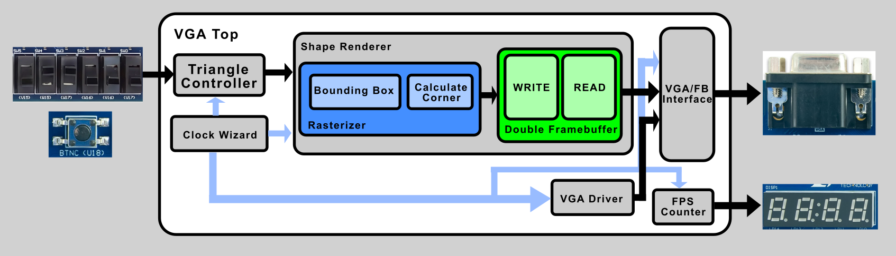

# VGA Triangle Rasterizer

**Autor:** Petru-Andrei Brașoveanu

### Istoric revizii

| Versiune | Modificări |
|---|---|
| 1.0. | Controller VGA funcțional, testbench pentru validare |
| 1.1. | LED pentru reset și setare culoare personalizată|
| 1.2. | Afișare forme geometrice statice pe monitor |
| 1.3. | Implementare Bounding Box, parametrizat prin switch-uri |
| 1.4. | Proiectare modul pentru ecuațiile Pineda de delimitare muchii (pentru colțul din stânga-sus, coordonate minime)|
| 1.5. | Finalizare rasterizator; scanarea întregului bounding box prin incrementare (adunări/scăderi)|
| 1.6. | Conectare double framebuffer cu restul proiectului; afișare cu succes a unui triunghi pe ecran |

---

## Cuprins
- [VGA Triangle Rasterizer](#vga-triangle-rasterizer)
    - [Istoric revizii](#istoric-revizii)
  - [Cuprins](#cuprins)
  - [1. Introducere](#1-introducere)
  - [2. Obiective](#2-obiective)
    - [2.1. Obiective proiect](#21-obiective-proiect)
    - [2.2. Obiective personalizate](#22-obiective-personalizate)
  - [3. Versiunea 1.0.](#3-versiunea-10)
    - [3.1. Specificații](#31-specificații)
      - [3.1.1. Obiectiv](#311-obiectiv)
      - [3.1.2. Realizare](#312-realizare)
      - [3.1.3. Dificultăți](#313-dificultăți)
      - [3.1.4. Mod de rezolvare](#314-mod-de-rezolvare)
    - [3.2. Simulare](#32-simulare)
      - [3.2.1. Obiectiv](#321-obiectiv)
      - [3.2.2. Realizare](#322-realizare)
      - [3.2.3. Dificultăți](#323-dificultăți)
      - [3.2.4. Mod de rezolvare](#324-mod-de-rezolvare)
    - [3.3. Implementare](#33-implementare)
      - [3.3.1. Obiectiv](#331-obiectiv)
      - [3.3.2. Realizare](#332-realizare)
      - [3.3.3. Dificultăți](#333-dificultăți)
      - [3.3.4. Mod de rezolvare](#334-mod-de-rezolvare)
  - [4. Versiunea 1.1: LED de stare reset și culoare personalizată](#4-versiunea-11-led-de-stare-reset-și-culoare-personalizată)
    - [4.1. Obiectiv](#41-obiectiv)
    - [4.2. Realizare](#42-realizare)
    - [4.3. Dificultăți](#43-dificultăți)
    - [4.4. Mod de rezolvare](#44-mod-de-rezolvare)
  - [5. Versiunea 1.2: Afișare forme geometrice](#5-versiunea-12-afișare-forme-geometrice)
    - [5.1. Obiectiv](#51-obiectiv)
    - [5.2. Realizare](#52-realizare)
    - [5.3. Dificultăți](#53-dificultăți)
    - [5.4. Mod de rezolvare](#54-mod-de-rezolvare)
  - [6. Versiunea 1.3: Implementare bounding box](#6-versiunea-13-implementare-bounding-box)
    - [6.1. Obiectiv](#61-obiectiv)
    - [6.2. Realizare](#62-realizare)
      - [6.2.1. Modulul `bounding_box`](#621-modulul-bounding_box)
      - [6.2.2. Modificări aduse modulului `shape_renderer`](#622-modificări-aduse-modulului-shape_renderer)
      - [6.2.3. Modulul `triangle_controller`](#623-modulul-triangle_controller)
    - [6.3. Dificultăți](#63-dificultăți)
    - [6.4. Mod de rezolvare](#64-mod-de-rezolvare)
  - [7. Versiunea 1.4: Ecuațiile Pineda pentru colțul de referință](#7-versiunea-14-ecuațiile-pineda-pentru-colțul-de-referință)
    - [7.1. Obiectiv](#71-obiectiv)
    - [7.2. Realizare](#72-realizare)
    - [7.3. Dificultăți](#73-dificultăți)
    - [7.4. Mod de rezolvare](#74-mod-de-rezolvare)
  - [8. Versiunea 1.5: Finalizare rasterizator](#8-versiunea-15-finalizare-rasterizator)
    - [8.1. Obiectiv](#81-obiectiv)
    - [8.2. Realizare](#82-realizare)
    - [8.3. Dificultăți](#83-dificultăți)
    - [8.4. Mod de rezolvare](#84-mod-de-rezolvare)
  - [9. Versiunea 1.6: Conectare double framebuffer cu restul proiectului](#9-versiunea-16-conectare-double-framebuffer-cu-restul-proiectului)
    - [9.1. Obiectiv](#91-obiectiv)
    - [9.2. Realizare](#92-realizare)
    - [9.3. Dificultăți](#93-dificultăți)
    - [9.4. Mod de rezolvare](#94-mod-de-rezolvare)

---

## 1. Introducere

Acest proiect urmărește conceperea unui rasterizer pentru un FPGA, care primește coordonatele unui triunghi (cele 3 puncte) oarecare, acesta fiind colorat pe ecran.

**Placă folosită:** Digilent Basys 3 (Xilinx Artix-7, `xc7a35ticpg236-1L`), ceas de sistem 100MHz.

**Module implicate:**

| Modul | Rol |
|---|---|
| `vga_top` | Top-level pentru placă |
| `vga_ctrl_block_wrapper` | Clocking wizard (MMCM), generează `pix_clk` din `clk_100MHz` |
| `triangle_controller` | Controlează cele 6 coordonate ale triunghiului (x0,y0,x1,y1,x2,y2) direct prin switch-urile de pe Basys3 |
| `shape_renderer` | Acesta conectează rasterizatorul cu framebuffer-ul |
| `rasterizer` | Scanează fiecare pixel din bounding_box dacă satisface ecuațiile Pineda |
| `bounding_box` | Primeste cele 3 varfuri ale unui triunghi si calculeaza dreptunghiul minim care il incadreaza |
| `calc_corner` | Calculul ecuațiilor de muchii Pineda pentru colțul din stânga-sus al bounding_box-ului (coordonatele minime) |
| `framebuffer_dbl` | Conține 2 buffere de memorie și logica de swap; când se citește un buffer, se scrie în altul și vice-versa |
| `vga_driver` | Generator de timing VGA (numărători, sincronizări, blanking)|
| `vga_fb_interface` | Interfață framebuffer-ecran VGA; conversie rezoluție 320p la 480p |
| `fps_counter` | Afișor FPS care contorizează numărul de pulsuri frame_done într-o secundă |



---

## 2. Obiective

### 2.1. Obiective proiect
Cerința de bază a proiectului: proiectarea unui controller VGA funcțional pentru rezoluția 640x480 @ 60Hz, capabil să afișeze o imagine validă pe un monitor conectat la placa Basys 3, verificat atât prin simulare, cât și prin implementare reală pe FPGA.

### 2.2. Obiective personalizate
- Adăugarea unui LED de stare pe placă, care indică vizual când butonul de reset e apăsat.
- Afișarea unei forme geometrice pe monitor, în locul culorii solide.
- Implementarea unui bounding box.
- Proiectare modul pentru calculul ecuațiilor Pineda.
- Double-framebuffer pentru stocare bitmap.
- Documentarea procesului de dezvoltare a proiectului.

---

## 3. Versiunea 1.0.

### 3.1. Specificații

#### 3.1.1. Obiectiv
Definirea parametrilor de timing pentru rezoluția 640x480 @ 60Hz și a interfeței modulelor implicate (`vga_driver`, `vga_top`, `vga_ctrl_block_wrapper`), astfel încât proiectul să poată fi verificat printr-un testbench înainte de a exista implementarea propriu-zisă.

#### 3.1.2. Realizare
S-au stabilit:

- Parametrii de timing standard pentru 640x480@60Hz:
  - Orizontal: `h_active=640`, `h_fp=16`, `h_sync=96`, `h_bp=48` → `h_total=800`
  - Vertical: `v_active=480`, `v_fp=10`, `v_sync=2`, `v_bp=33` → `v_total=525`
  - Polaritate sincronizări: negativă (`h_pol=0`, `v_pol=0`)
- Interfața modulului `vga_driver`:
  - Intrări: `pix_clk`, `rst_n`
  - Ieșiri: `hsync`, `vsync`, `vga_red`, `vga_green`, `vga_blue`
  - Parametri: `color_w`, `image_red`, `image_green`, `image_blue` (culoare fixă folosită ca pattern de test)
- Un testbench (`tb_vga_top`) care modelează independent numărătorii de poziție (`model_h`, `model_v`) și compară, ciclu cu ciclu, ieșirile DUT-ului cu valorile așteptate.

#### 3.1.3. Dificultăți
- Definirea exactă a ferestrelor de sync (front porch / sync / back porch) astfel încât modelul din testbench și implementarea reală să folosească aceeași convenție de indexare (ex: `>=` vs `>`).

#### 3.1.4. Mod de rezolvare
S-a fixat o singură sursă de adevăr pentru parametrii de timing (aceleași `localparam`-uri folosite atât în testbench, cât și, ulterior, în DUT), eliminând ambiguitatea. Convenția aleasă: zona de sync e `[h_active+h_fp, h_active+h_fp+h_sync)`, cu limita inferioară inclusă și cea superioară exclusă.

---

### 3.2. Simulare

#### 3.2.1. Obiectiv
Verificarea funcțională a modulului `vga_driver` (numărători, generare sincronizări, generare culoare, comportament la reset) folosind testbench-ul `tb_vga_top`, înainte de a trece la implementare pe placă.

#### 3.2.2. Realizare
S-a scris modulul `vga_driver`:

- doi numărători sincroni pe `pix_clk` (`h_cnt`, `v_cnt`) care parcurg întreg cadrul;
- logică combinațională pentru zona activă (`active`), zona de hsync și zona de vsync, derivată direct din numărători;
- generarea `hsync`/`vsync` pe baza polarității configurate;
- generarea culorii: `image_red/green/blue` în zona activă, `0` în rest (blanking).

Testbench-ul rulează trei tipuri de verificări:
- verificare pixel-cu-pixel (comparație cu un model software al numărătorilor);
- verificare pe cadru complet (numărătoare agregate: pixeli activi, pixeli de blank, pixeli de hsync/vsync);
- test de reset la jumătate de cadru, urmat de verificare cadre complete după reset.

#### 3.2.3. Dificultăți
La prima rulare, testul de reset eșua cu eroarea `expected output zero during reset`, deși sincronizările ieșeau corect. Cauza: la `h_cnt=0, v_cnt=0` (starea imediat după reset), condiția de zonă activă (`h_cnt<h_active && v_cnt<v_active`) era adevărată, deci `vga_red/green/blue` ieșeau cu culoarea de test în loc de `0` — reset-ul numărătorilor nu era suficient pentru a garanta o ieșire de culoare "sigură", pentru că starea `(0,0)` cade chiar la începutul zonei active, nu în afara ei (spre deosebire de zonele de sync, care sunt la coordonate mari și nu sunt afectate).

#### 3.2.4. Mod de rezolvare
Condiționarea explicită a ieșirii de culoare și de starea `rst_n`, nu doar de `active`:

```systemverilog
assign vga_red   = (rst_n && active) ? image_red   : '0;
assign vga_green = (rst_n && active) ? image_green : '0;
assign vga_blue  = (rst_n && active) ? image_blue  : '0;
```

După corecție, testul complet a trecut: `vga test passed with 0 errors`, cu toate cele 4 cadre complete verificate după reset având valori identice și corecte (`active=307200`, `expected=307200`, `hsync=50400`, `vsync=1600`).

---

### 3.3. Implementare

#### 3.3.1. Obiectiv
Integrarea `vga_driver` într-un top-level de placă (`vga_top`), care generează ceasul de pixel din ceasul de sistem al plăcii (`clk_100MHz`) folosind un clocking wizard (`vga_ctrl_block_wrapper` → `vga_ctrl_block`, generat cu unealta Xilinx/Vivado), pregătit pentru sinteză și implementare pe FPGA.

#### 3.3.2. Realizare
S-a creat modulul `vga_top`, care:

- instanțiază `vga_ctrl_block_wrapper` pentru a genera `pix_clk` din `clk_100MHz`;
- preia semnalul de reset al plăcii (`btnC`, activ pe 1) și îl folosește atât pentru `reset_rtl_0` al clocking wizard-ului, cât și, inversat, ca `rst_n` (activ pe 0) pentru `vga_driver`;
- instanțiază `vga_driver`, conectând `pix_clk` și `rst_n`, și propagă ieșirile (`hsync`, `vsync`, `vga_red/green/blue`) către porturile de top.

S-au scris constrângerile (`.xdc`) pentru Basys 3: ceas pe `W5`, buton de reset (`btnC`) pe `U18`, semnalele VGA pe pinii standard ai conectorului de pe placă.

#### 3.3.3. Dificultăți
- `vga_ctrl_block_wrapper` nu expune un semnal `locked` al MMCM-ului: doar `clk_out1_0` și `reset_rtl_0`. Fără acest semnal, nu se poate garanta că `vga_driver` pornește abia după ce ceasul de pixel e stabil.
- Interfața de top (`clk_100MHz`, `btnC`) nu mai coincide cu interfața testată de `tb_vga_top` (`pix_clk`, `rst_n`), deci testbench-ul existent nu se mai poate lega direct de `vga_top`.
- La scrierea constrângerilor (`.xdc`), pornind de la template-ul master de la Digilent, liniile de `PACKAGE_PIN` au fost redenumite cu numele porturilor proprii (`vga_red`, `hsync`, `reset` etc.), dar liniile de `IOSTANDARD` de dedesubt au rămas cu numele vechi din template (`vgaRed`, `Hsync`, `btnC`). Rezultatul ar fi fost critical warnings la implementare ("port does not match any port in the current design") și erori DRC (`IOSTANDARD` nespecificat) la generarea bitstream-ului.
- **Bug de polaritate pe reset:** ieșirea `rst_n` a `vga_driver` a fost conectată inițial direct la semnalul de reset (activ pe 1), fără inversare. Rezultat: în funcționare normală (buton neapăsat), `vga_driver` rămânea permanent în reset, numărătorii `h_cnt`/`v_cnt` înghețau pe `0`, `hsync`/`vsync` nu mai făceau tranziții, iar monitorul nu primea semnal valid (afișa "no signal" în loc de imagine).
- S-a evaluat necesitatea unui sincronizator de reset (dublu flip-flop) pentru trecerea semnalului `reset` din domeniul `clk_100MHz` în domeniul `pix_clk`, ca protecție împotriva metastabilității.

#### 3.3.4. Mod de rezolvare
- Bug-ul de polaritate a fost corectat conectând `rst_n` la `~reset` în loc de `reset`, restabilind funcționarea normală în afara reset-ului.
- Sincronizatorul de reset a fost evaluat ca **neesențial** pentru acest proiect: reset-ul controlează doar doi numărători care rulează liber, fără stare persistentă; un eventual glitch de metastabilitate ar produce cel mult o pâlpâire imperceptibilă la un singur cadru, auto-corectată la cadrul următor (16.7ms mai târziu), nu o defecțiune persistentă. Sincronizatorul a fost eliminat din `vga_top` pentru simplitate, rămânând documentat ca opțiune de bună practică dacă cerințele proiectului cer rigoare suplimentară de tip CDC (clock domain crossing).
- Lipsa semnalului `locked` a fost documentată ca limitare cunoscută, cu recomandarea de a regenera IP-ul de clocking wizard cu opțiunea de `locked` activată, dacă apar probleme de stabilitate la pornire.
- Constrângerile au fost corectate astfel încât numele de port din liniile `IOSTANDARD` să fie identic cu cel din liniile `PACKAGE_PIN` corespunzătoare. Pinii fizici folosiți (clock pe `W5`, buton de reset pe `U18`, semnalele VGA pe `G19/H19/J19/N19` etc.) au fost verificați ca fiind corecți pentru placa Basys 3, contra fișierului master `.xdc` oficial de la Digilent.


**Utilizare resurse:**

| Resursă | Utilizare | Procent (%) |
|---|---|---|
| LUT | 27 | 0.13 |
| FF | 20 | 0.05 |
| IO | 17 | 16.04 |
| BUFG | 2 | 6.25 |
| MMCM | 1 | 20 |

**Timing closure:**

| Setup | Hold | Pulse Width |
|---|---|---|
| WNS = 36.426 ns | WHS = 0.063 ns | WPWS = 3.0 ns|

---

## 4. Versiunea 1.1: LED de stare reset și culoare personalizată

### 4.1. Obiectiv
Adăugarea unui LED pe placă care indică vizual starea de reset (aprins cât timp butonul e apăsat), și configurarea unei culori de test personalizate în locul culorii solide inițiale (roșu pur).

### 4.2. Realizare
- S-a adăugat portul `rst_led` la `vga_top`, conectat direct la semnalul de reset: `assign rst_led = reset;`.
- S-a adăugat constrângerea pentru LED în `.xdc`, pe pinul `U16` (`LED[0]` pe Basys 3), verificat contra fișierului master `.xdc` oficial de la Digilent.
- S-a înlocuit culoarea implicită de test (`image_red=4'hF, image_green=4'h0, image_blue=4'h0` — roșu pur) cu o culoare personalizată, derivată dintr-un cod hex web `#00FFDA` (turcoaz).

### 4.3. Dificultăți
Modulul folosește 4 biți per canal de culoare (`color_w=4`), adică doar 16 nivele posibile per canal, față de cele 256 dintr-un cod hex web standard (8 biți per canal). Conversia unui cod hex arbitrar la 4 biți nu poate fi exactă în general.

### 4.4. Mod de rezolvare
Conversia s-a făcut prin trunchierea fiecărui canal de la 8 la 4 biți (`valoare_4bit = valoare_8bit >> 4`, echivalent cu împărțire la 16, rotunjită în jos):

- R: `0x00 >> 4 = 0x0`
- G: `0xFF >> 4 = 0xF`
- B: `0xDA (218) >> 4 = 0xD` (13)

```systemverilog
parameter logic [color_w-1:0] image_red   = 4'h0,
parameter logic [color_w-1:0] image_green = 4'hF,
parameter logic [color_w-1:0] image_blue  = 4'hD
```

Rezultatul afișat pe monitor corespunde culorii 8-bit `#00FFDD` (221 în loc de 218 pe canalul albastru) — o diferență de 3 unități față de codul original, invizibilă cu ochiul liber, dar de reținut ca limitare inerentă a rezoluției de 4 biți/canal (12-bit RGB total), nu o eroare de calcul.

---

## 5. Versiunea 1.2: Afișare forme geometrice
 
### 5.1. Obiectiv
Proiectarea unui modul separat, strict dedicat logicii de desen, capabil să afișeze un dreptunghi și un cerc (nu doar o culoare solidă), parametrizabil, și integrarea lui în `vga_top`.
 
### 5.2. Realizare
S-a creat modulul `shape_renderer`, complet independent de timing-ul VGA:
 
- primește coordonatele pixelului curent (`h_pos`, `v_pos`);
- decide combinațional dacă pixelul se află în interiorul unui dreptunghi (`rect_x`, `rect_y`, `rect_w`, `rect_h`) și/sau al unui cerc (`circle_cx`, `circle_cy`, `circle_r`), fiecare cu propria culoare și flag de activare (`rect_enable`, `circle_enable`);
- pentru dreptunghi, testul e o simplă încadrare în interval: `h_pos ∈ [rect_x, rect_x+rect_w)` și `v_pos ∈ [rect_y, rect_y+rect_h)`;
- pentru cerc, testul e pe distanța la pătrat față de centru: `(h_pos-cx)² + (v_pos-cy)² <= r²`, ca să se evite o rădăcină pătrată în hardware;
- dacă cele două forme se suprapun, cercul are prioritate (se "vede deasupra" dreptunghiului); în rest, se afișează culoarea de fundal (`bg_red/green/blue`).
Pentru a face loc acestui modul, `vga_driver` a fost **modificat**: nu mai primește o culoare fixă prin parametri (`image_red/green/blue`), ci expune coordonatele curente către exterior (`h_pos`, `v_pos`, 10 biți fiecare) și primește înapoi culoarea calculată (`pix_red/green/blue`) de la orice modul extern îi e conectat. Practic, `vga_driver` a devenit strict un generator de timing + blanking, indiferent de ce se desenează.
 
`vga_top` a fost actualizat să instanțieze ambele module și să le conecteze printr-o pereche de semnale intermediare (`current_x`/`current_y` pentru coordonate, `shape_red/green/blue` pentru culoare) — fără nicio buclă de ceas între ele, e o simplă propagare combinațională într-un singur sens logic (coordonate → culoare), chiar dacă fizic semnalele circulă prin ambele module.
 
### 5.3. Dificultăți
- **Nepotrivire de lățime pe `v_pos`:** `vga_driver` expune `h_pos`/`v_pos` cu lățime fixă de 10 biți (`[9:0]`), în timp ce portul `v_pos` al lui `shape_renderer` e parametrizat la `$clog2(v_active)` biți — pentru `v_active=480`, asta înseamnă **9 biți**, nu 10. Conectarea unui semnal de 10 biți la un port de 9 biți generează un warning de sinteză (width mismatch), chiar dacă rezultatul rămâne corect (valorile lui `v_cnt` sunt oricum sub 480 în zona activă, deci încap în 9 biți fără pierdere).
- Calculul de distanță pentru cerc (`dx*dx + dy*dy`) introduce o înmulțire în hardware, spre deosebire de testul de dreptunghi, care e doar comparații. Sinteza a mapat aceste înmulțiri pe blocuri DSP dedicate ale FPGA-ului (vizibil în utilizarea de resurse: `DSP = 2`, absent înainte de această extindere).
- Timpul de proiectare a crescut ușor din cauza interfeței "bidirecționale" dintre `vga_driver` și `shape_renderer` (unul expune coordonate, celălalt primește culoare înapoi) — deși nu e o buclă combinațională reală (nu există dependență circulară: coordonatele nu depind de culoare), denumirea/structura poate fi confundată la prima vedere cu un feedback loop.

### 5.4. Mod de rezolvare
- Nepotrivirea de lățime pe `v_pos` a fost acceptată ca inofensivă funcțional (valorile rămân mereu în intervalul reprezentabil pe 9 biți), dar rămâne documentată ca aspect de curățat ulterior — fie prin declararea lui `current_y` pe 9 biți în `vga_top`, fie prin lățirea portului `v_pos` al lui `shape_renderer` la 10 biți fix, pentru consistență.
- Utilizarea de blocuri DSP pentru calculul cercului a fost acceptată ca un compromis normal: bugetul de resurse al FPGA-ului (Artix-7 pe Basys 3) are suficiente DSP-uri disponibile (utilizare finală: doar 2.22%), deci nu reprezintă un risc de epuizare a resurselor.
- Separarea strictă a responsabilităților (timing în `vga_driver`, desen în `shape_renderer`) a fost menținută ca decizie de design, chiar cu costul unei interfețe puțin mai complexe în `vga_top`, pentru că permite testarea/extinderea independentă a logicii de desen (adăugarea de forme noi nu mai necesită modificarea `vga_driver`).

**Utilizare resurse:**
 
| Resursă | Utilizare | Procent (%) |
|---|---|---|
| LUT | 55 | 0.26 |
| FF | 20 | 0.05 |
| DSP | 2 | 2.22 |
| IO | 17 | 16.04 |
| BUFG | 2 | 6.25 |
| MMCM | 1 | 20 |
 
**Timing closure:**
 
| Setup | Hold | Pulse Width |
|---|---|---|
| WNS = 36.027 ns | WHS = 0.09 ns | WPWS = 3.0 ns |
 
---

## 6. Versiunea 1.3: Implementare bounding box
 
### 6.1. Obiectiv
Proiectarea unui modul care calculează dreptunghiul minim ce încadrează triunghiul oarecare. Acestă implementare evită risipa de scanare a întregului ecran în cazul în care avem un triunghi foarte mic. De asemenea, acesta trebuie modifcat dinamic prin schimbarea coordonatelor punctelor triunghiului prin switch-urile de pe Basys3.
 
### 6.2. Realizare

Implementarea versiunii 1.3 introduce trei module noi/modificate față de versiunea anterioară: `bounding_box`, `shape_renderer` (modificat) și `triangle_controller`.

#### 6.2.1. Modulul `bounding_box`

**Rol:** calculează dreptunghiul minim care încadrează un triunghi oarecare, definit prin cele 3 vârfuri ale sale.

**Parametri:**
- `COORD_W` — lățimea în biți a coordonatelor de intrare/ieșire.
- `SCREEN_W`, `SCREEN_H` — dimensiunea ecranului, folosită pentru limitarea (*clamping*) rezultatului.

**Porturi de intrare:** `x0,y0`, `x1,y1`, `x2,y2` — cele 3 perechi de coordonate ale vârfurilor triunghiului, ca valori întregi simple (fără parte fracționară).

**Porturi de ieșire:** `min_x`, `max_x`, `min_y`, `max_y` — limitele (inclusive) ale dreptunghiului de încadrare.

**Funcționare:**
1. Se calculează `min_x`/`max_x` prin compararea celor 3 coordonate X între ele (folosind operatori ternari în cascadă: se compară primele două, apoi rezultatul cu al treilea), și analog pentru `min_y`/`max_y`.
2. Rezultatul brut este apoi limitat (*clamp*) astfel încât să nu depășească dimensiunea ecranului — necesar deoarece un vârf al triunghiului poate, teoretic, avea coordonate în afara zonei vizibile.

Modulul este complet combinațional (nu conține logică secvențială), fiind gândit ca bloc reutilizabil, independent de restul lanțului de randare.

#### 6.2.2. Modificări aduse modulului `shape_renderer`

Versiunea anterioară a lui `shape_renderer` desena două forme fixe, cu poziție și dimensiune constante, stabilite prin parametri (`rect_x`, `rect_y`, `rect_w`, `rect_h` pentru dreptunghi; `circle_cx`, `circle_cy`, `circle_r` pentru cerc), combinate cu prioritate cerc > dreptunghi > fundal.

În versiunea 1.3, această logică a fost înlocuită complet:

- Au fost eliminate toate semnalele și parametrii legați de cerc (`circle_enable`, `circle_cx/cy/r`, `circle_red/green/blue`, precum și logica de calcul a distanței la pătrat `dx`, `dy`, `dist_sq`, `radius_sq`).
- Dreptunghiul fix a fost înlocuit cu un dreptunghi *dinamic*, obținut prin instanțierea internă a modulului `bounding_box`.
- Modulul primește acum 6 porturi noi de intrare: `x0, y0, x1, y1, x2, y2` — vârfurile triunghiului curent, cu aceeași lățime în biți ca și `h_pos`/`v_pos`.
- Semnalul `in_rect` din varianta veche (comparație cu limite fixe) a fost înlocuit cu `in_bbox`, care compară poziția curentă a pixelului (`h_pos`, `v_pos`) cu limitele întoarse de `bounding_box` (`min_x`, `max_x`, `min_y`, `max_y`).
- Logica de combinare a culorilor (fostul `always_comb`/`always @*` cu 3 ramuri: cerc, dreptunghi, fundal) a fost simplificată la 2 ramuri: `in_bbox` → culoarea dreptunghiului (`bbox_red/green/blue`), altfel → culoarea de fundal (`bg_red/green/blue`).

Practic, `shape_renderer` a trecut de la a "desena forme statice, definite la momentul sintezei" la a "desena un dreptunghi calculat dinamic, în funcție de un triunghi ale cărui coordonate pot varia în timpul funcționării plăcii" — pregătind terenul pentru controlul prin switch-uri descris mai jos.

#### 6.2.3. Modulul `triangle_controller`

**Rol:** permite modificarea, în timp real, a celor 6 coordonate ale triunghiului (și implicit a bounding box-ului rezultat), folosind switch-urile fizice de pe placa Basys3.

**Maparea switch-urilor:**

| Switch | Coordonată controlată |
|---|---|
| `sw[0]` | x0 |
| `sw[1]` | y0 |
| `sw[2]` | x1 |
| `sw[3]` | y1 |
| `sw[4]` | x2 |
| `sw[5]` | y2 |

**Principiu de funcționare:** un singur switch oferă un singur bit de informație, insuficient pentru a specifica direct o valoare de coordonată (0–639 pe orizontală, 0–479 pe verticală). De aceea, fiecare coordonată este controlată printr-o mișcare automată de tip "du-te-vino" (*bounce*): cât timp switch-ul corespunzător este pe poziția "sus", coordonata respectivă crește constant până atinge marginea ecranului, apoi își schimbă direcția și scade până la 0, și tot așa, ciclic. Când switch-ul este pe "jos", coordonata rămâne înghețată pe ultima valoare atinsă.

**Implementare internă:**
- Un singur numărător (*divizor de ceas*), comun pentru toate cele 6 coordonate, generează un semnal `tick` la un interval fix (constanta `SPEED_DIV_BITS`, aleasă empiric pentru o viteză de deplasare vizibilă, dar controlabilă).
- Pentru fiecare coordonată există un bit de direcție (`dir_x0`, `dir_y0` etc.) care reține sensul curent de mișcare (crescător/descrescător).
- La fiecare puls `tick`, dacă switch-ul asociat este activ, coordonata este incrementată sau decrementată cu 1, iar direcția se inversează automat la atingerea limitelor ecranului (0, respectiv `H_ACTIVE-1`/`V_ACTIVE-1`).
- Logica este scrisă direct pentru toate cele 6 coordonate în același modul (fără submodule instanțiate repetat), pentru simplitate.

**Integrare:** ieșirile `x0..y2` ale lui `triangle_controller` sunt conectate direct la porturile `x0..y2` ale lui `shape_renderer` din `vga_top`, iar `sw[5:0]` este adus ca port de intrare la nivelul întregului top-level, mapat în constrângerile fizice (`.xdc`) la switch-urile reale de pe placă.

### 6.3. Dificultăți

- **Discrepanța de lățime între axe:** `$clog2(640) = 10` biți pentru coordonatele orizontale, dar `$clog2(480) = 9` biți pentru cele verticale. Conectarea directă a unor semnale de 10 biți (ex. `current_y`) la porturi de 9 biți putea produce trunchieri silențioase.
- **Un singur bit per coordonată:** un switch nu poate seta direct o valoare între 0 și 639/479 — a fost necesară alegerea unei strategii de control alternative (mișcare automată tip bounce) în locul unei mapări directe valoare-switch.
- **Alegerea vitezei de mișcare:** o viteză prea mare face triunghiul greu de poziționat cu precizie, iar una prea mică îl face impractic de demonstrat pe monitor.
- **Prioritatea formelor:** eliminarea cercului din `shape_renderer` a necesitat re-verificarea întregii logici de combinare a culorilor, pentru a nu lăsa referințe neutilizate la semnale de cerc.

### 6.4. Mod de rezolvare

- Coordonatele X și Y au fost tratate separat pe toată durata lanțului de module (`bounding_box`, `shape_renderer`, `triangle_controller`), fiecare cu propria lățime de biți dedusă din `$clog2(H_ACTIVE)` respectiv `$clog2(V_ACTIVE)`, evitând trunchierea implicită.
- Controlul cu un singur bit a fost rezolvat printr-o logică de tip bounce (creștere până la limită, apoi scădere până la 0, ciclic), activată/dezactivată direct de switch-ul corespunzător (funcție de tip *enable/freeze*).
- Viteza de mișcare a fost fixată printr-un divizor de ceas cu o constantă (`SPEED_DIV_BITS`) aleasă experimental, pentru un echilibru între vizibilitate și controlabilitate.
- `shape_renderer` a fost simplificat la o singură formă dinamică (bounding box), eliminând complet ramurile și semnalele legate de cerc.

**Utilizare resurse:**
 
| Resursă | Utilizare | Procent (%) |
|---|---|---|
| LUT | 354 | 1.70 |
| FF | 104 | 0.25 |
| IO | 23 | 21.70 |
| BUFG | 3 | 9.38 |
| MMCM | 1 | 20 |
 
**Timing closure:**
 
| Setup | Hold | Pulse Width |
|---|---|---|
| WNS = 4.361 ns | WHS = 0.117 ns | WPWS = 3.0 ns |
 
---

## 7. Versiunea 1.4: Ecuațiile Pineda pentru colțul de referință

### 7.1. Obiectiv
Proiectarea modulului `calc_corner`, care calculează, pentru colțul stânga-sus al bounding box-ului obținut anterior (`min_x`, `min_y`), valorile inițiale ale celor 3 funcții de muchie (*edge functions*, algoritmul Pineda), împreună cu coeficienții de incrementare `A` (pasul pe orizontală, `ΔY = yB-yA`) și `B` (pasul pe verticală, `ΔX = xB-xA`), necesari ulterior rasterizorului pentru parcurgerea incrementală a bounding box-ului, fără a mai reface înmulțirile la fiecare pixel.

### 7.2. Realizare
S-a creat modulul `calc_corner`, cu o arhitectură de tip FSM (`IDLE → LOAD → MULT → SUB_STORE → DONE_ST`):

- **`IDLE`** așteaptă pulsul `start`.
- **`LOAD`** eșantionează în registre interne (`r_px`, `r_py`, `r_x0..r_y2`) punctul testat și cele 3 vârfuri ale triunghiului, și inițializează contorul de muchie `edge_idx` la 0.
- Selecția segmentului de muchie curent (`xA,yA → xB,yB`) se face combinațional, în funcție de `edge_idx` (muchia 0: V0→V1, muchia 1: V1→V2, muchia 2: V2→V0).
- **`MULT`** calculează cele două produse parțiale ale formulei `E(px,py) = (px-xA)*(yB-yA) - (py-yA)*(xB-xA)`, mapate de sintetizator pe blocuri DSP.
- **`SUB_STORE`** face scăderea celor două produse, salvează rezultatul (`E0/E1/E2_out`) și coeficienții `A`/`B` corespunzători muchiei curente, apoi incrementează `edge_idx`.
- Ciclul `MULT → SUB_STORE` se repetă de 3 ori (câte o dată pentru fiecare muchie), înainte de a trece în **`DONE_ST`**, unde se generează pulsul `valid` (1 ciclu).

Modulul procesează cele 3 muchii **secvențial**, refolosind același multiplicator, nu în paralel cu 3 seturi de multiplicatoare — decizie de design motivată de faptul că acest calcul se execută o singură dată per triunghi (la fiecare `start`), nu per pixel, deci latența suplimentară introdusă de secvențialitate e neglijabilă în raport cu economia de resurse DSP.

### 7.3. Dificultăți
- Determinarea lățimii corecte de biți pentru rezultatele intermediare, astfel încât să nu apară overflow: fiecare diferență (`DIFF_BITS = COORD_BITS+1`) poate crește cu un bit față de coordonate, produsul a două diferențe dublează lățimea (`PROD_BITS = 2*DIFF_BITS`), iar scăderea a două produse mai necesită un bit suplimentar de siguranță (`E_BITS = PROD_BITS+1`).
- Alegerea între o arhitectură paralelă (3 seturi de multiplicatoare, rezultat într-un singur ciclu de calcul) și una secvențială (un singur set, reutilizat de 3 ori) — un compromis clasic resurse-vs-latență, fără o soluție "corectă" universală, ci dependentă de bugetul de resurse disponibil pe Artix-7.
- Triunghiul poate fi definit de utilizator (prin switch-uri) atât în sens orar, cât și antiorar, ceea ce înseamnă că semnul rezultatelor `E0/E1/E2` nu e fixat dinainte — testul de apartenență la triunghi trebuie să accepte ambele convenții de orientare, nu doar una singură.

### 7.4. Mod de rezolvare
- S-a ales arhitectura secvențială, considerând că un calcul unic per triunghi (nu per pixel) face latența suplimentară neglijabilă, în timp ce economia de DSP-uri rămâne relevantă pentru un FPGA de dimensiuni modeste ca Artix-7 de pe Basys 3.
- Lățimile de biți au fost calculate riguros pe baza analizei de tip worst-case și documentate explicit prin `localparam`-uri (`DIFF_BITS`, `PROD_BITS`, `E_BITS`), eliminând orice ghicire ulterioară a dimensiunilor.
- `calc_corner` a fost proiectat să producă pur și simplu valorile `E0/E1/E2` (cu semn), fără să impună o convenție de orientare — decizia de a accepta ambele semne posibile (toate `E >= 0` SAU toate `E <= 0`) a fost mutată în modulul `rasterizer` (semnalul `pixel_inside`), păstrând `calc_corner` ca bloc de calcul pur, independent de interpretarea rezultatului.

---

## 8. Versiunea 1.5: Finalizare rasterizator

### 8.1. Obiectiv
Proiectarea modulului `rasterizer`, care integrează `bounding_box` și `calc_corner` și parcurge întregul bounding box pixel cu pixel, testând apartenența la triunghi și trimițând comenzi de scriere către framebuffer doar pentru pixelii din interior, folosind exclusiv adunări/scăderi pentru avansul între pixeli (algoritmul incremental Pineda), fără a reface nicio înmulțire în interiorul buclei de scanare.

### 8.2. Realizare
`rasterizer` instanțiază intern `bounding_box` (pentru limitele `min_x/max_x/min_y/max_y`) și `calc_corner` (pentru valorile inițiale `E0/E1/E2_init` și coeficienții `A0/A1/A2`, `B0/B1/B2`), și implementează o FSM proprie cu stările `IDLE → WAIT_CORNER → EVAL_PIXEL → DRAW_WAIT → ADVANCE → FINISHED`:

- **`WAIT_CORNER`** așteaptă pulsul `corner_valid` de la `calc_corner`; la sosirea lui, inițializează atât registrele "curente" (`E0_cur/E1_cur/E2_cur`), cât și registrele "de rând" (`E0_row/E1_row/E2_row`, valoarea de referință pentru începutul fiecărui rând), și poziționează `cur_x/cur_y` pe `min_x/min_y`.
- **`EVAL_PIXEL`** testează semnalul combinațional `pixel_inside` (adevărat dacă toate cele 3 valori `E_cur` au același semn, indiferent care). Dacă pixelul e în interior, se trece în `DRAW_WAIT`; altfel, direct în `ADVANCE`.
- **`DRAW_WAIT`** menține comanda de scriere (`fb_cs`, `fb_wr`) activă exact 1 ciclu (puls), apoi așteaptă ca `fb_busy` să scadă înainte de a permite avansul — un mecanism simplu de *flow control* cu framebuffer-ul.
- **`ADVANCE`** implementează pasul incremental: dacă `cur_x < reg_max_x`, se avansează pe orizontală (`cur_x += 1`, iar `E0/E1/E2_cur += A0/A1/A2` — o simplă adunare); altfel, dacă `cur_y < reg_max_y`, se trece la începutul rândului următor (`cur_x = reg_min_x`, `cur_y += 1`), iar valorile de referință ale rândului sunt actualizate prin scădere (`E_row -= B`), și tot din acestea se reinițializează `E_cur` pentru primul pixel al noului rând.
- **`FINISHED`** ridică pulsul `done`, semnalând terminarea completă a scanării bounding box-ului pentru triunghiul curent.

Acest tipar (o adunare pentru fiecare pas orizontal, o scădere pentru fiecare capăt de rând) este esența optimizării algoritmului Pineda: nicio înmulțire nu mai are loc în interiorul buclei de scanare pixel-cu-pixel, spre deosebire de `calc_corner`, unde înmulțirile apar o singură dată, la inițializare.

### 8.3. Dificultăți
- Sincronizarea FSM-ului `rasterizer` cu pulsul de 1 ciclu `corner_valid` al lui `calc_corner`: dacă tranziția din `WAIT_CORNER` nu era exact aliniată cu ciclul în care `valid` era activ, exista riscul de a rata inițializarea și de a porni scanarea cu valori vechi/nedefinite.
- Gestionarea corectă a semnalului `fb_busy`: dacă framebuffer-ul rămâne ocupat mai multe cicluri (de exemplu în timpul unei operații de clear pornite de `shape_renderer`), rasterizorul trebuie să rămână în `DRAW_WAIT` fără să piardă pixeli sau să avanseze coordonatele înainte de a confirma scrierea.
- Determinarea exactă a condiției de terminare (`FINISHED`): tranziția trebuia plasată astfel încât ultimul pixel al bounding box-ului (`cur_x==reg_max_x && cur_y==reg_max_y`) să fie efectiv procesat înainte de oprire, nu omis din scanare printr-o verificare prematură.

### 8.4. Mod de rezolvare
- S-a folosit direct pulsul `corner_valid` ca unică sursă de adevăr pentru momentul preluării valorilor inițiale, eliminând orice presupunere legată de o "valoare stabilă" ulterioară — preluarea are loc exact în ciclul activ al pulsului.
- Starea `DRAW_WAIT` a fost introdusă special pentru a decupla momentul evaluării unui pixel de momentul confirmării scrierii lui, oferind framebuffer-ului timpul necesar pentru operații interne fără a corupe datele sau a pierde comenzi de scriere.
- Condiția de avans în `ADVANCE` a fost proiectată ca ultima operație a buclei de scanare, astfel încât tranziția către `FINISHED` are loc abia după ce coordonatele curente ating efectiv `(reg_max_x, reg_max_y)`, garantând acoperirea completă a bounding box-ului, inclusiv ultima linie și ultima coloană.

---

## 9. Versiunea 1.6: Conectare double framebuffer cu restul proiectului

### 9.1. Obiectiv
Integrarea completă a lanțului de randare (`triangle_controller → shape_renderer → rasterizer → framebuffer_dbl`) cu restul proiectului (`vga_top`, `vga_driver`, `vga_fb_interface`), astfel încât un triunghi ale cărui coordonate sunt controlate live prin switch-uri să fie afișat corect, fără efect de flicker, pe monitor, folosind un framebuffer dublu (*double buffering*).

### 9.2. Realizare
- `shape_renderer` a fost extins să instanțieze atât `rasterizer`, cât și `framebuffer_dbl`, generând semnalele `swap_pulse` și `clear_pulse` pornind de la un singur eveniment extern, `frame_end_pulse` (semnalizând sfârșitul unui cadru VGA): `swap_pulse` este o copie a lui `frame_end_pulse` întârziată cu 1 ciclu de ceas, iar `clear_pulse` este întârziat cu încă un ciclu față de `swap_pulse` — garantând ordinea corectă a operațiilor (întâi comutarea bufferelor, abia apoi curățarea noului buffer din spate).
- `framebuffer_dbl` instanțiază 2 module `framebuffer` identice (`u_fb0`, `u_fb1`) și un registru `disp_buf`, care indică ce buffer este afișat curent; bufferul de scriere (`write_buf`) este mereu complementul lui `disp_buf`. Semnalele de scriere (`cs`/`wr`/`clear`) sunt demultiplexate către instanța corectă în funcție de `write_buf`, iar `rd_dataOut` este multiplexat din instanța corectă în funcție de `disp_buf`, astfel încât rasterizorul scrie mereu în bufferul "din spate", iar afișarea citește mereu bufferul "din față", fără conflict între ele.
- `vga_fb_interface` face conversia dintre rezoluția logică a framebuffer-ului (320×240) și rezoluția fizică a monitorului (640×480), printr-o scalare 2×2 (shiftare pe biți, `SCALE_SHIFT_X`/`SCALE_SHIFT_Y`), calculează adresa liniară în BRAM (`y_logic * H_RES_LOGIC + x_logic`) și introduce un pipeline de 1 ciclu de întârziere pe `hsync`/`vsync`/`vde`, pentru a compensa latența de citire a memoriei.
- `vga_top` leagă întregul lanț: `triangle_controller` primește switch-urile fizice și generează cele 6 coordonate ale triunghiului; `shape_renderer` primește aceste coordonate, un semnal `start` și pulsul de sfârșit de cadru; culoarea rezultată ajunge, prin `vga_fb_interface`, la pinii fizici VGA ai plăcii — obținându-se afișarea cu succes a unui triunghi pe monitor.

### 9.3. Dificultăți
- Diferența dintre rezoluția logică a framebuffer-ului (320×240) și rezoluția fizică VGA (640×480) a necesitat proiectarea suplimentară a modulului `vga_fb_interface`, exclusiv pentru conversia de coordonate și scalare, ceea ce a întârziat integrarea finală față de estimarea inițială.
- Riscul de suprapunere între momentul comutării bufferelor (`swap`) și momentul în care rasterizorul scrie efectiv un pixel: dacă cele două ar avea loc necontrolat în același ciclu, triunghiul ar putea apărea parțial desenat pe ecran, sau un cadru vechi ar rămâne vizibil un ciclu în plus.
- Latența de 1 ciclu a citirii din BRAM trebuia compensată exact; necompensarea ei ar fi produs o deplasare vizibilă a imaginii afișate față de semnalele de sincronizare (`hsync`/`vsync`), percepută ca o "alunecare" orizontală a triunghiului pe ecran.
- Verificarea comportamentului la vârfuri de triunghi aflate în afara ecranului (posibil oricând, din moment ce switch-urile pot seta liber orice combinație de coordonate) — nevoia de a confirma că nu apar scrieri în afara limitelor framebuffer-ului sau blocaje ale FSM-ului `rasterizer`.

### 9.4. Mod de rezolvare
- S-a introdus explicit modulul `vga_fb_interface`, responsabil exclusiv de conversia rezoluție logică ↔ rezoluție fizică, păstrând `shape_renderer` complet independent de rezoluția fizică a monitorului — poate fi refolosit neschimbat la orice altă rezoluție de ieșire, doar interfața de conversie s-ar adapta.
- `swap_pulse` și `clear_pulse` au fost proiectate ca pulsuri strict secvențiale, derivate dintr-un singur eveniment (`frame_end_pulse`), eliminând orice ambiguitate legată de ordinea operațiilor; rasterizorul continuă să scrie în același `write_buf` atâta timp cât nu are loc un nou `swap`, deci nu există fereastră de conflict între o scriere în desfășurare și comutarea bufferelor.
- Latența BRAM a fost compensată explicit printr-un pipeline de întârziere pe `vde`/`hsync`/`vsync` (registrele `vde_d`, `hsync_d`, `vsync_d` din `vga_fb_interface`), aliniind semnalele de sincronizare cu momentul în care datele de culoare devin efectiv disponibile la ieșire.
- Limitarea (*clamp*) coordonatelor bounding box-ului la dimensiunea ecranului, deja implementată în `bounding_box` (versiunea 1.3), s-a dovedit suficientă și în acest context: chiar dacă vârfurile triunghiului ies din ecran, dreptunghiul de încadrare rezultat rămâne mereu în interiorul zonei valide, deci `rasterizer` nu accesează niciodată coordonate negative sau peste limita framebuffer-ului.

**Utilizare resurse:**

| Resursă | Utilizare | Procent (%) |
|---|---|---|
| *LUT* | 782 | 3.76 |
| *FF* | 617 | 1.48 |
| *BRAM* | 6 | 12 |
| *DSP* | 2 | 2.22 |
| *IO* | 35 | 33.02 |
| *BUFG* | 2 | 6.25 |
| *MMCM* | 1 | 20 |

**Timing closure:**

| Setup | Hold | Pulse Width |
|---|---|---|
| *28.58 ns* | *0.025 ns* | *3 ns* |

---
